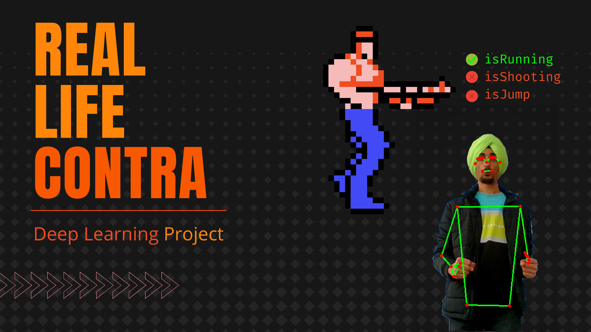

# real-life-contra

<h1>Description</h1>
A python script that translates the body movement into in game control. 
Welcome to all new real life contra a deep learning project built using mediapipe and opencv. Pyautogui is used to send key inputs for the game.
This is my new project which is built by using python and runs at smooth 20 fps.  
In this player in front of the camera have to give input in form of real actions and those real actions are converted to keyboard inputs by using this python project. 

<h1>Features</h1>
For shooting : Join hands to make gun like shape 
For Jump : Simple jump  
For Run : Simple Run 
 

<h1>Explanation</h1>
video explanation : https://youtu.be/HVCcmBI_59I 

 

<h1>Connect with me</h1>
If you have any queries regarding any of the topic I discussed in this video feel free to talk to e using below links: 
facebook : https://m.facebook.com/proogramminghub 
instagram : @programming_hut 
twitter : https://twitter.com/programming_hut 
github : https://github.com/Pawandeep-prog 
discord : https://discord.gg/G5Cunyg 
linkedin : https://www.linkedin.com/in/programminghut 
youtube : https://www.youtube.com/c/programminghutofficial 

      
  
<h1>Keywords</h1>
keys,
contra,using python,contra using python,python deep learning games,mediapipe games,playing contra,machine learning project,deep learning project,python bot game,real life contra,virtual contra,pubg
